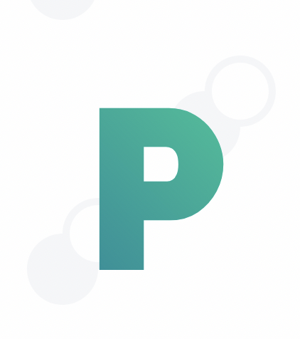

<div id="top"></div>

<!-- PROJECT LOGO -->
<br />
<div align="center">
  <a href="https://github.com/leovoon/link-shortener">
    
  </a>
   <br />

<h3 align="center"><b>Pendek</b></h3>

  <p align="center">
   Link Shortener
    <br />
    <br />
    <a href="https://pendek.netlify.app">View Demo</a>
    ·
    <a href="https://github.com/leovoon/link-shortener/issues">Report Bug</a>
    ·
    <a href="https://github.com/leovoon/link-shortener/issues">Request Feature</a>
  </p>
</div>

<div align="center">

[]()
[](https://github.com/leovoon/link-shortener/issues)
[](https://github.com/leovoon/link-shortener)
[](https://opensource.org/licenses/MIT)

</div>

<br/>

<!-- TABLE OF CONTENTS -->
<details>
  <summary>Table of Contents</summary>
  <ol>
    <li>
      <a href="#about-the-project">About The Project</a>
      <ul>
        <li><a href="#built-with">Built With</a></li>
      </ul>
    </li>
    <li>
      <a href="#getting-started">Getting Started</a>
      <ul>
        <li><a href="#installation">Installation</a></li>
      </ul>
    </li>
    <li><a href="#contributing">Contributing</a></li>
    <li><a href="#license">License</a></li>
    <li><a href="#acknowledgments">Acknowledgments</a></li>
  </ol>
</details>

<br/>
<!-- ABOUT THE PROJECT -->

## About The Project

_Pendek_ means short in Malay. Turn your link into a shorter link.

<p align="right">(<a href="#top">back to top</a>)</p>

### Built With

- [SvelteKit](https://kit.svelte.dev/)
- [Prisma](https://www.prisma.io/)
- [PlanetScale](https://planetscale.com)

<p align="right">(<a href="#top">back to top</a>)</p>

<!-- GETTING STARTED -->

## Getting Started

To get a local copy up and running follow these simple example steps.

- npm
  ```sh
  npm install npm@latest -g
  ```

### Installation

1. Clone the repo
   ```sh
   git clone https://github.com/leovoon/link-shortener.git
   ```
2. Install NPM packages
   ```sh
   npm install
   ```
   <p align="right">(<a href="#top">back to top</a>)</p>

<p align="right">(<a href="#top">back to top</a>)</p>

<!-- CONTRIBUTING -->

## Contributing

Any contributions you make are **greatly appreciated**.

<p align="right">(<a href="#top">back to top</a>)</p>

<!-- LICENSE -->

## License

Distributed under the MIT License.

<p align="right">(<a href="#top">back to top</a>)</p>

<!-- ACKNOWLEDGMENTS -->

## Acknowledgments

- [lihautan](https://twitter.com/lihautan/status/1327630230018682880) Flipboard effect
- [TheoBr](https://github.com/TheoBr/joltik) Inspired by his NextJs version

<p align="right">(<a href="#top">back to top</a>)</p>
